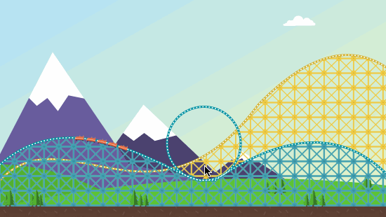

## RollerCoasterAnimation

Mainly used classes in the project :

- `CAShapeLayer`
- `CAGradientLayer`
- `CAKeyframeAnimation`

## OverView

## Thanks

This animation is learning from  [W_C__L](http://my.csdn.net/wang631106979)‘s blog.

## License

RollerCoasterAnimation is released under the MIT license. See LICENSE for details.

